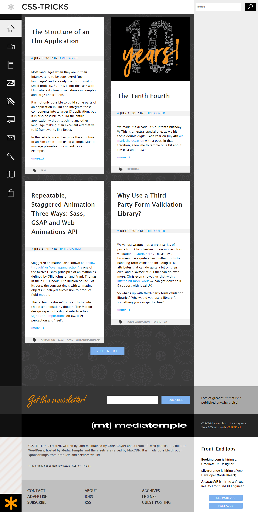

This project represents the example of CSS-Trics Web Site.

To run it you need to follow next steps:
1. Write "npm i" in the WebStorm terminal with installed Node.js.
2. Write "gulp" in terminal.

Site markup:

